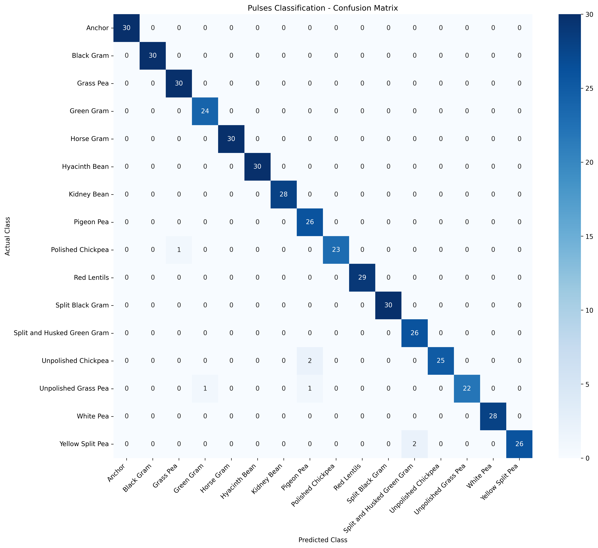
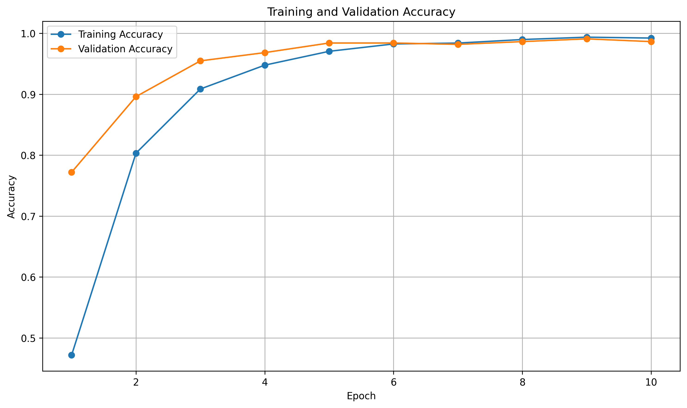
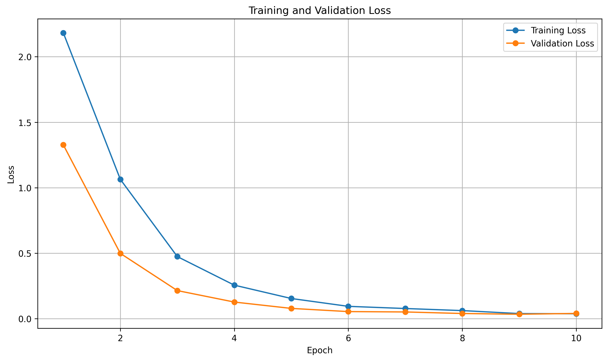
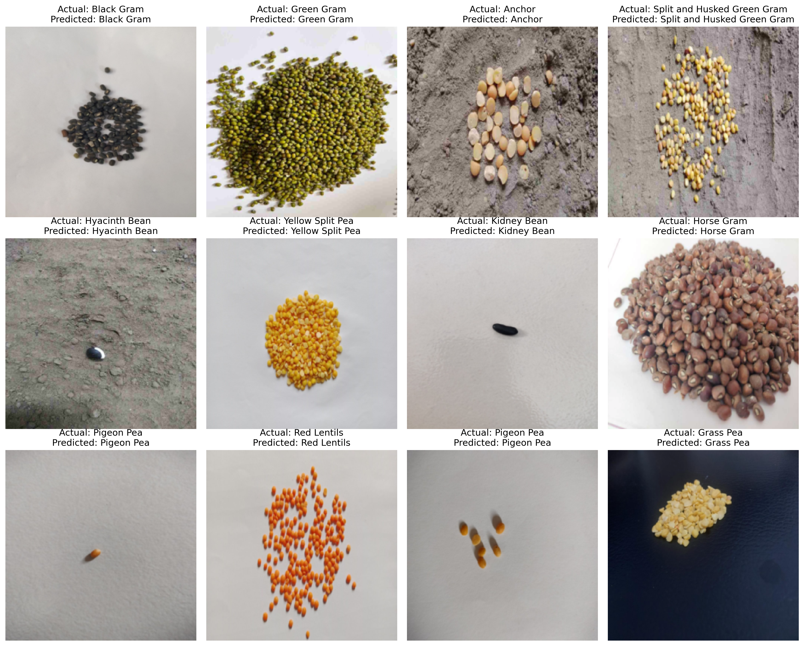

# Pulses Image Classification

A deep learning-based image classification project for identifying
different types and varieties of pulses using transfer learning
with EfficientNet-B0.

---

## 1. Project Overview

This project develops an image classification model capable of
classifying pulse images into 16 different classes.

The project uses a publicly available pulse image dataset and
applies image preprocessing, data augmentation, transfer learning,
model training, validation and evaluation.

The final model is also tested on external images using an
inference pipeline.

---

## 2. Dataset

### Dataset Name

An Image Dataset of Seven Major Pulses Grown in Bangladesh

### Dataset Source

[DATASET URL WILL BE ADDED HERE]

### Dataset Description

The dataset contains images of different varieties and forms of
pulses. After inspecting and preparing the dataset, 2,956 valid
images were used for this classification task.

The dataset contains 16 classes.

### Classes

The classes used in this project are:

1. Anchor
2. Black Gram
3. Grass Pea
4. Green Gram
5. Horse Gram
6. Hyacinth Bean
7. Kidney Bean
8. Pigeon Pea
9. Polished Chickpea
10. Red Lentils
11. Split Black Gram
12. Split and Husked Green Gram
13. Unpolished Chickpea
14. Unpolished Grass Pea
15. White Pea
16. Yellow Split Pea

---

## 3. Dataset Statistics

Total images: 2,956

| Dataset Split | Number of Images |
|---|---:|
| Training | 2,069 |
| Validation | 443 |
| Testing | 444 |
| Total | 2,956 |

No corrupted images were found during dataset validation.

---

## 4. Data Preprocessing

The following preprocessing steps were applied:

- Images were converted to RGB format.
- Images were resized to 224 × 224 pixels.
- Images were converted to PyTorch tensors.
- Images were normalized using ImageNet mean and standard deviation.

The ImageNet normalization values used were:

Mean:

    [0.485, 0.456, 0.406]

Standard deviation:

    [0.229, 0.224, 0.225]

---

## 5. Data Augmentation

Data augmentation was applied to the training images to improve
generalization and reduce overfitting.

The augmentation pipeline included transformations such as:

- Random horizontal flipping
- Random rotation
- Color variation

Validation and test images were not randomly augmented so that
their performance could be measured consistently.

---

## 6. Model Architecture

### EfficientNet-B0

EfficientNet-B0 was selected as the classification model.

The model uses ImageNet pretrained weights and transfer learning.

The original classification layer was replaced with a new fully
connected layer containing 16 output classes.

Conceptually:

Input Image
    ↓
Resize 224 × 224
    ↓
EfficientNet-B0 Backbone
    ↓
Feature Extraction
    ↓
Fully Connected Layer
    ↓
16 Class Outputs
    ↓
Predicted Pulse Class

---

## 7. Why Transfer Learning?

Instead of training the entire neural network from scratch, a model
pretrained on ImageNet was used.

The pretrained network has already learned useful visual features
such as:

- edges
- textures
- shapes
- patterns
- object structures

These features can be adapted to the pulse classification problem.

Transfer learning is especially useful when the available dataset
is relatively small.

---

## 8. Training Configuration

| Parameter | Value |
|---|---|
| Model | EfficientNet-B0 |
| Pretrained weights | ImageNet |
| Image size | 224 × 224 |
| Batch size | 32 |
| Optimizer | Adam |
| Learning rate | 0.0001 |
| Loss function | CrossEntropyLoss |
| Number of classes | 16 |
| Epochs | 10 |

---

## 9. Evaluation Metrics

The model was evaluated using:

### Accuracy

Measures the percentage of correctly classified images.

### Precision

Measures how many images predicted as a particular class actually
belong to that class.

### Recall

Measures how many images belonging to a particular class were
correctly identified.

### F1-score

Provides a balance between precision and recall.

Weighted averaging was used for the multiclass precision, recall
and F1-score calculations.

---

## 10. Results

| Metric | Score |
|---|---:|
| Best Validation Accuracy | 99.10% |
| Test Accuracy | 98.42% |
| Precision | 98.54% |
| Recall | 98.42% |
| F1-score | 98.43% |

The final values will be updated with the actual experimental
results.

---

## 11. Confusion Matrix

The confusion matrix shows the relationship between actual and
predicted classes.

The diagonal represents correctly classified images, while
off-diagonal values represent misclassifications.



---

## 12. Training Curves

### Training and Validation Accuracy



### Training and Validation Loss



These curves are used to understand model learning behaviour and
identify potential overfitting or underfitting.

---

## 13. Sample Predictions

Example predictions generated by the trained model:



The visualization compares the actual class with the predicted
class for randomly selected test images.

---

## 14. Inference on New Images

The trained model can be used to classify a new pulse image.

Example:

```python
predicted_class, confidence = predict_image(
    "path/to/new/image.jpg"
)